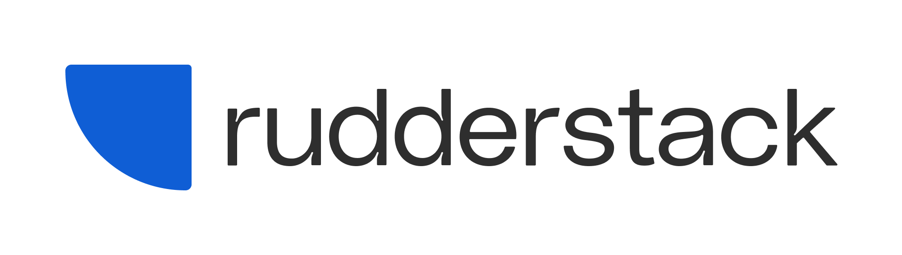
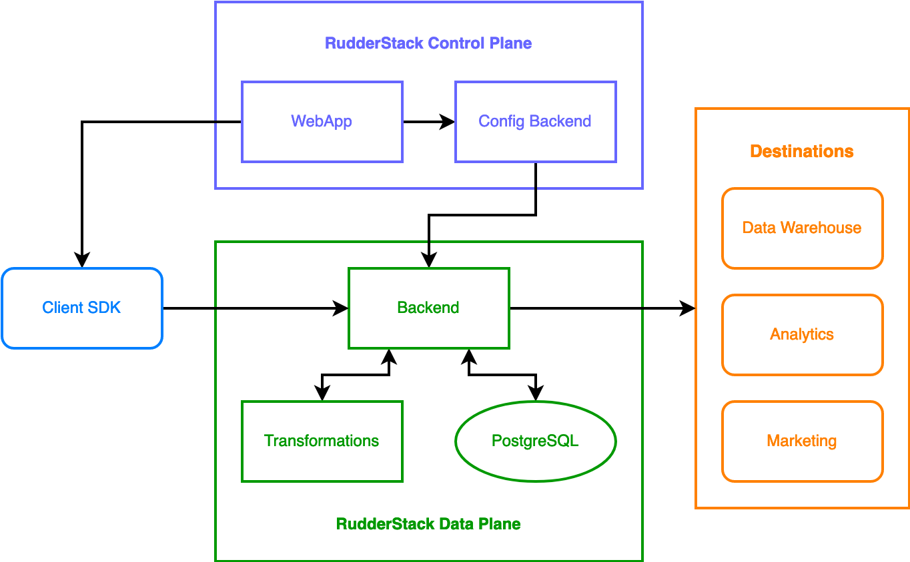

📖 Just launched <b><a href="https://www.rudderstack.com/learn/">Data Learning Center</a></b> - Resources on data engineering and data infrastructure
   
 

  

<b>The Customer Data Platform for Developers</b>

  
  
  
  
  
  

  <b>
    <a href="https://www.rudderstack.com/">Website</a>
    ·
    <a href="https://www.rudderstack.com/docs/">Documentation</a>
    ·
    <a href="https://github.com/rudderlabs/rudder-server/blob/master/CHANGELOG.md">Changelog</a>
    ·
    <a href="https://www.rudderstack.com/blog/">Blog</a>
    ·
    <a href="https://www.rudderstack.com/join-rudderstack-slack-community/">Slack</a>
    ·
    <a href="https://twitter.com/rudderstack">Twitter</a>
  </b>

---

As the leading open source Customer Data Platform (CDP), [**RudderStack**](https://www.rudderstack.com/) provides data pipelines that make it easy to collect data from every application, website and SaaS platform, then activate it in your warehouse and business tools.

With RudderStack, you can build customer data pipelines that connect your whole customer data stack and then make them smarter by triggering enrichment and activation in customer tools based on analysis in your data warehouse. It's easy-to-use SDKs and event source integrations, Cloud Extract integrations, transformations, and expansive library of destination and warehouse integrations makes building customer data pipelines for both event streaming and cloud-to-warehouse ELT simple.

  

| Try **RudderStack Cloud Free** - a free tier of [**RudderStack Cloud**](https://www.rudderstack.com/cloud/). Click [**here**](https://app.rudderstack.com/signup?type=freetrial) to start building a smarter customer data pipeline today, with RudderStack Cloud. |
| :----------------------------------------------------------------------------------------------------------------------------------------------------------------------------------------------------------------------------------------------------------------- |

## Key features

- **Warehouse-first**: RudderStack treats your data warehouse as a first class citizen among destinations, with advanced features and configurable, near real-time sync.

- **Developer-focused**: RudderStack is built API-first. It integrates seamlessly with the tools that the developers already use and love.

- **High Availability**: RudderStack comes with at least 99.99% uptime. We have built a sophisticated error handling and retry system that ensures that your data will be delivered even in the event of network partitions or destinations downtime.

- **Privacy and Security**: You can collect and store your customer data without sending everything to a third-party vendor. With RudderStack, you get fine-grained control over what data to forward to which analytical tool.

- **Unlimited Events**: Event volume-based pricing of most of the commercial systems is broken. With RudderStack Open Source, you can collect as much data as possible without worrying about overrunning your event budgets.

- **Segment API-compatible**: RudderStack is fully compatible with the Segment API. So you don't need to change your app if you are using Segment; just integrate the RudderStack SDKs into your app and your events will keep flowing to the destinations (including data warehouses) as before.

- **Production-ready**: Companies like Mattermost, IFTTT, Torpedo, Grofers, 1mg, Nana, OnceHub, and dozens of large companies use RudderStack for collecting their events.

- **Seamless Integration**: RudderStack currently supports integration with over 90 popular [**tool**](https://www.rudderstack.com/docs/destinations/) and [**warehouse**](https://www.rudderstack.com/docs/data-warehouse-integrations/) destinations.

- **User-specified Transformation**: RudderStack offers a powerful JavaScript-based event transformation framework which lets you enhance or transform your event data by combining it with your other internal data. Furthermore, as RudderStack runs inside your cloud or on-premise environment, you can easily access your production data to join with the event data.

## Get started

The easiest way to experience RudderStack is to [**sign up**](https://app.rudderstack.com/signup?type=freetrial) for **RudderStack Cloud Free** - a completely free tier of [**RudderStack Cloud**](https://www.rudderstack.com/cloud/).

You can also set up RudderStack on your platform of choice with these two easy steps:

### Step 1: Set up RudderStack

- [**Docker**](https://www.rudderstack.com/docs/rudderstack-open-source/installing-and-setting-up-rudderstack/docker/)
- [**Kubernetes**](https://www.rudderstack.com/docs/rudderstack-open-source/installing-and-setting-up-rudderstack/kubernetes/)
- [**Developer machine setup**](https://www.rudderstack.com/docs/rudderstack-open-source/installing-and-setting-up-rudderstack/developer-machine-setup/)

> **Note**: If you are planning to use RudderStack in production, we STRONGLY recommend using our Kubernetes Helm charts. We update our Docker images with bug fixes much more frequently than our GitHub repo.

### Step 2: Verify the installation

Once you have installed RudderStack, [**send test events**](https://www.rudderstack.com/docs/get-started/installing-and-setting-up-rudderstack/sending-test-events/) to verify the setup.

## Architecture

RudderStack is an independent, stand-alone system with a dependency only on the database (PostgreSQL). Its backend is written in **Go** with a rich UI written in **React.js**.

A high-level view of RudderStack’s architecture is shown below:

For more details on the various architectural components, refer to our [**documentation**](https://www.rudderstack.com/docs/get-started/rudderstack-architecture/).

## Contribute

We would love to see you contribute to RudderStack. Get more information on how to contribute [**here**](https://github.com/rudderlabs/rudder-server/blob/master/CONTRIBUTING.md).

## License

RudderStack server is released under the [**Elastic License 2.0**](LICENSE).

